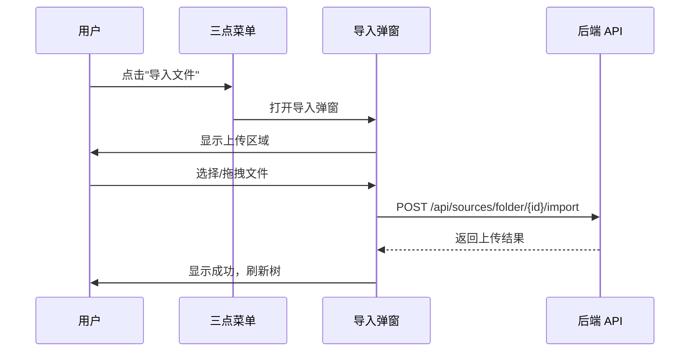

# 数据源面板层级文件树重构设计方案

## 一、需求概述

将左侧数据源面板从平铺列表重构为层级文件树结构，支持：
1. **文件夹组织** - 用户可创建文件夹，将数据源分类管理
2. **极简交互** - 点击项目 = 查看详情；其他操作统一收入三点菜单
3. **文件夹导入** - 支持向指定文件夹导入本地文件或从已连接数据源复制
4. **视觉层级** - 嵌套缩进、展开/折叠、文件类型图标

---

## 二、数据模型设计

### 2.1 MongoDB 文档结构扩展

现有 `uploaded_sources` 集合需要扩展字段：

```typescript
// 扩展后的 Source 文档
interface SourceDocument {
  _id: ObjectId;
  sha256: string;
  filename: string;
  rel_path: string;          // 保留，用于显示
  size: number;
  content: Binary;
  created_at: Date;
  
  // 新增字段
  parent_id: string | null;  // 父文件夹 ID，null 表示根目录
  item_type: "file" | "folder";  // 区分文件和文件夹
  sort_order: number;        // 同级排序权重
  updated_at: Date;          // 更新时间
}
```

### 2.2 文件夹节点

文件夹是一种特殊的 Source 文档：

```typescript
// 文件夹文档示例
{
  _id: ObjectId("..."),
  filename: "研究资料",
  rel_path: "研究资料",
  parent_id: null,           // 根目录下
  item_type: "folder",
  size: 0,
  content: null,             // 文件夹无内容
  sort_order: 0,
  created_at: ISODate("..."),
  updated_at: ISODate("...")
}
```

### 2.3 前端类型定义

```typescript
// frontend/src/ui/types/index.ts 新增

export type SourceItem = {
  id: string;
  filename: string;
  rel_path: string;
  parent_id: string | null;
  item_type: "file" | "folder";
  size: number;
  file_type?: string;        // 文件扩展名，如 pdf, md, docx
  sort_order: number;
  created_at: string;
  updated_at: string;
  children?: SourceItem[];   // 前端构建树时使用
  expanded?: boolean;        // 展开状态（前端本地）
};

export type SourceTreeNode = SourceItem & {
  children: SourceTreeNode[];
  depth: number;             // 层级深度，用于缩进计算
};
```

---

## 三、后端 API 设计

### 3.1 新增接口

#### 3.1.1 获取树形结构

```
GET /api/sources/tree
```

返回完整的树形结构数据：

```json
{
  "items": [
    {
      "id": "folder_001",
      "filename": "研究资料",
      "parent_id": null,
      "item_type": "folder",
      "size": 0,
      "sort_order": 0,
      "created_at": "2026-01-31T10:00:00Z",
      "updated_at": "2026-01-31T10:00:00Z",
      "children": [
        {
          "id": "file_001",
          "filename": "论文.pdf",
          "parent_id": "folder_001",
          "item_type": "file",
          "size": 1024000,
          "file_type": "pdf",
          "sort_order": 0,
          "created_at": "2026-01-31T10:00:00Z",
          "updated_at": "2026-01-31T10:00:00Z"
        }
      ]
    }
  ]
}
```

#### 3.1.2 创建文件夹

```
POST /api/sources/folder
Content-Type: application/json

{
  "name": "新文件夹",
  "parent_id": null          // 可选，默认根目录
}
```

响应：

```json
{
  "id": "folder_002",
  "filename": "新文件夹",
  "parent_id": null,
  "item_type": "folder"
}
```

#### 3.1.3 移动项目

```
POST /api/sources/{id}/move
Content-Type: application/json

{
  "target_parent_id": "folder_001"   // null 表示移到根目录
}
```

#### 3.1.4 复制项目

```
POST /api/sources/{id}/duplicate
Content-Type: application/json

{
  "target_parent_id": "folder_002"   // 可选，默认同级
}
```

#### 3.1.5 批量导入到文件夹

```
POST /api/sources/folder/{folder_id}/import
Content-Type: multipart/form-data

files: [File...]
```

#### 3.1.6 从已有数据源导入

```
POST /api/sources/folder/{folder_id}/import-from-sources
Content-Type: application/json

{
  "source_ids": ["source_001", "source_002"]
}
```

### 3.2 修改现有接口

#### 3.2.1 上传接口增加 parent_id

```
POST /api/sources/upload
Content-Type: multipart/form-data

files: [File...]
parent_id: "folder_001"      // 可选，默认根目录
```

#### 3.2.2 列表接口增加树形支持

```
GET /api/sources/list?parent_id={id}&flat=false
```

参数：
- `parent_id`: 筛选指定文件夹下的项目
- `flat`: true 返回平铺列表（兼容旧逻辑），false 返回树形

---

## 四、前端组件架构

### 4.1 组件结构

```
frontend/src/ui/components/FileTree/
  index.tsx              # 主入口，导出 FileTree 组件
  FileTreeNode.tsx       # 单个节点组件（文件/文件夹）
  FileTreeContext.tsx    # 树状态管理 Context
  KebabMenu.tsx          # 三点菜单下拉组件
  FolderImportModal.tsx  # 文件夹导入弹窗
  hooks/
    useFileTree.ts       # 树操作 hooks
    useExpandState.ts    # 展开状态管理
  icons/
    FileIcons.tsx        # 文件类型图标组件
  styles/
    filetree.css         # 样式文件
```

### 4.2 核心组件设计

#### 4.2.1 FileTree 主组件

```tsx
// FileTree/index.tsx
interface FileTreeProps {
  onSelectItem: (item: SourceItem) => void;
  selectedIds: Set<string>;
  onSelectionChange: (ids: Set<string>) => void;
}

export function FileTree({ onSelectItem, selectedIds, onSelectionChange }: FileTreeProps) {
  const { tree, loading, refresh, createFolder, moveItem, deleteItem } = useFileTree();
  const { expandedIds, toggleExpand, expandAll, collapseAll } = useExpandState();
  
  return (
    <FileTreeContext.Provider value={{ ... }}>
      <div class="file-tree">
        <FileTreeHeader onCreateFolder={createFolder} />
        <div class="file-tree-content">
          {tree.map(node => (
            <FileTreeNode 
              key={node.id} 
              node={node} 
              depth={0}
              expanded={expandedIds.has(node.id)}
              onToggle={() => toggleExpand(node.id)}
            />
          ))}
        </div>
      </div>
    </FileTreeContext.Provider>
  );
}
```

#### 4.2.2 FileTreeNode 节点组件

```tsx
// FileTree/FileTreeNode.tsx
interface FileTreeNodeProps {
  node: SourceTreeNode;
  depth: number;
  expanded: boolean;
  onToggle: () => void;
}

export function FileTreeNode({ node, depth, expanded, onToggle }: FileTreeNodeProps) {
  const { onSelectItem, selectedIds } = useFileTreeContext();
  const [menuOpen, setMenuOpen] = useState(false);
  
  const isFolder = node.item_type === "folder";
  const hasChildren = isFolder && node.children.length > 0;
  const indentPx = depth * 16;  // 每层缩进 16px
  
  return (
    <div class="file-tree-node-wrapper">
      <div 
        class={`file-tree-node ${selectedIds.has(node.id) ? 'selected' : ''}`}
        style={{ paddingLeft: `${indentPx}px` }}
        onClick={() => onSelectItem(node)}
      >
        {/* 展开/折叠按钮 */}
        <button 
          class={`expand-btn ${!hasChildren ? 'invisible' : ''}`}
          onClick={(e) => { e.stopPropagation(); onToggle(); }}
        >
          {expanded ? <ChevronDown /> : <ChevronRight />}
        </button>
        
        {/* 图标 */}
        <FileIcon type={isFolder ? 'folder' : node.file_type} expanded={expanded} />
        
        {/* 文件名 */}
        <span class="node-name" title={node.filename}>
          {node.filename}
        </span>
        
        {/* 三点菜单 */}
        <div class="node-actions" onClick={(e) => e.stopPropagation()}>
          <button 
            class="kebab-btn"
            onClick={() => setMenuOpen(!menuOpen)}
          >
            <MoreVertIcon />
          </button>
          {menuOpen && (
            <KebabMenu 
              item={node}
              onClose={() => setMenuOpen(false)}
            />
          )}
        </div>
        
        {/* 复选框 */}
        <input 
          type="checkbox"
          checked={selectedIds.has(node.id)}
          onChange={(e) => { e.stopPropagation(); toggleSelect(node.id); }}
        />
      </div>
      
      {/* 子节点 */}
      {isFolder && expanded && (
        <div class="file-tree-children">
          {node.children.map(child => (
            <FileTreeNode 
              key={child.id}
              node={child}
              depth={depth + 1}
              expanded={expandedIds.has(child.id)}
              onToggle={() => toggleExpand(child.id)}
            />
          ))}
        </div>
      )}
    </div>
  );
}
```

#### 4.2.3 KebabMenu 三点菜单

```tsx
// FileTree/KebabMenu.tsx
interface KebabMenuProps {
  item: SourceItem;
  onClose: () => void;
}

export function KebabMenu({ item, onClose }: KebabMenuProps) {
  const { renameItem, deleteItem, moveItem, duplicateItem, shareItem, importToFolder } = useFileTreeContext();
  const isFolder = item.item_type === "folder";
  
  const menuItems = [
    // 通用操作
    { label: "重命名", icon: <EditIcon />, action: () => renameItem(item) },
    { label: "移动到...", icon: <MoveIcon />, action: () => moveItem(item) },
    { label: "复制", icon: <CopyIcon />, action: () => duplicateItem(item) },
    { label: "分享", icon: <ShareIcon />, action: () => shareItem(item) },
    { type: "divider" },
    { label: "删除", icon: <DeleteIcon />, action: () => deleteItem(item), danger: true },
    
    // 文件夹专属操作
    ...(isFolder ? [
      { type: "divider" },
      { label: "导入文件", icon: <UploadIcon />, action: () => importToFolder(item, "upload") },
      { label: "从数据源导入", icon: <ImportIcon />, action: () => importToFolder(item, "sources") },
    ] : []),
  ];
  
  return (
    <div class="kebab-menu" onClickOutside={onClose}>
      {menuItems.map((menuItem, idx) => 
        menuItem.type === "divider" 
          ? <div key={idx} class="menu-divider" />
          : (
            <button 
              key={idx}
              class={`menu-item ${menuItem.danger ? 'danger' : ''}`}
              onClick={() => { menuItem.action(); onClose(); }}
            >
              {menuItem.icon}
              <span>{menuItem.label}</span>
            </button>
          )
      )}
    </div>
  );
}
```

### 4.3 状态管理

#### 4.3.1 useFileTree Hook

```tsx
// FileTree/hooks/useFileTree.ts
export function useFileTree() {
  const [tree, setTree] = useState<SourceTreeNode[]>([]);
  const [loading, setLoading] = useState(false);
  
  // 获取树形数据
  const fetchTree = async () => {
    setLoading(true);
    try {
      const resp = await fetch('/api/sources/tree');
      const data = await resp.json();
      setTree(buildTree(data.items));
    } finally {
      setLoading(false);
    }
  };
  
  // 创建文件夹
  const createFolder = async (name: string, parentId: string | null = null) => {
    const resp = await fetch('/api/sources/folder', {
      method: 'POST',
      headers: { 'Content-Type': 'application/json' },
      body: JSON.stringify({ name, parent_id: parentId }),
    });
    if (resp.ok) {
      await fetchTree();
    }
  };
  
  // 移动项目
  const moveItem = async (itemId: string, targetParentId: string | null) => {
    const resp = await fetch(`/api/sources/${itemId}/move`, {
      method: 'POST',
      headers: { 'Content-Type': 'application/json' },
      body: JSON.stringify({ target_parent_id: targetParentId }),
    });
    if (resp.ok) {
      await fetchTree();
    }
  };
  
  // 删除项目
  const deleteItem = async (itemId: string) => {
    const resp = await fetch(`/api/sources/${itemId}`, { method: 'DELETE' });
    if (resp.ok) {
      await fetchTree();
    }
  };
  
  // 重命名
  const renameItem = async (itemId: string, newName: string) => {
    const resp = await fetch(`/api/sources/${itemId}`, {
      method: 'PATCH',
      headers: { 'Content-Type': 'application/json' },
      body: JSON.stringify({ filename: newName }),
    });
    if (resp.ok) {
      await fetchTree();
    }
  };
  
  // 复制
  const duplicateItem = async (itemId: string, targetParentId?: string | null) => {
    const resp = await fetch(`/api/sources/${itemId}/duplicate`, {
      method: 'POST',
      headers: { 'Content-Type': 'application/json' },
      body: JSON.stringify({ target_parent_id: targetParentId }),
    });
    if (resp.ok) {
      await fetchTree();
    }
  };
  
  useEffect(() => {
    fetchTree();
  }, []);
  
  return { tree, loading, refresh: fetchTree, createFolder, moveItem, deleteItem, renameItem, duplicateItem };
}

// 将平铺数据构建为树形结构
function buildTree(items: SourceItem[]): SourceTreeNode[] {
  const map = new Map<string, SourceTreeNode>();
  const roots: SourceTreeNode[] = [];
  
  // 首先创建所有节点
  items.forEach(item => {
    map.set(item.id, { ...item, children: [], depth: 0 });
  });
  
  // 建立父子关系
  items.forEach(item => {
    const node = map.get(item.id)!;
    if (item.parent_id && map.has(item.parent_id)) {
      const parent = map.get(item.parent_id)!;
      parent.children.push(node);
      node.depth = parent.depth + 1;
    } else {
      roots.push(node);
    }
  });
  
  // 排序：文件夹在前，文件在后；同类按 sort_order 排序
  const sortNodes = (nodes: SourceTreeNode[]) => {
    nodes.sort((a, b) => {
      if (a.item_type !== b.item_type) {
        return a.item_type === 'folder' ? -1 : 1;
      }
      return a.sort_order - b.sort_order;
    });
    nodes.forEach(node => sortNodes(node.children));
  };
  
  sortNodes(roots);
  return roots;
}
```

---

## 五、样式设计

### 5.1 CSS 变量

```css
/* frontend/src/ui/styles/filetree.css */

:root {
  --tree-indent: 16px;
  --tree-node-height: 36px;
  --tree-icon-size: 16px;
  --tree-hover-bg: rgba(0, 0, 0, 0.04);
  --tree-selected-bg: rgba(0, 0, 0, 0.08);
  --tree-folder-color: #f9a825;
  --tree-file-color: #5f6368;
}
```

### 5.2 节点样式

```css
.file-tree {
  display: flex;
  flex-direction: column;
  height: 100%;
  overflow: hidden;
}

.file-tree-content {
  flex: 1;
  overflow-y: auto;
  padding: 4px 0;
}

.file-tree-node {
  display: flex;
  align-items: center;
  height: var(--tree-node-height);
  padding: 0 12px;
  cursor: pointer;
  transition: background-color 0.15s;
  gap: 8px;
}

.file-tree-node:hover {
  background-color: var(--tree-hover-bg);
}

.file-tree-node.selected {
  background-color: var(--tree-selected-bg);
}

.expand-btn {
  width: 20px;
  height: 20px;
  padding: 0;
  border: none;
  background: transparent;
  cursor: pointer;
  display: flex;
  align-items: center;
  justify-content: center;
  border-radius: 4px;
  color: var(--text-secondary);
  flex-shrink: 0;
}

.expand-btn:hover {
  background-color: rgba(0, 0, 0, 0.08);
}

.expand-btn.invisible {
  visibility: hidden;
}

.node-icon {
  width: var(--tree-icon-size);
  height: var(--tree-icon-size);
  flex-shrink: 0;
}

.node-icon.folder {
  color: var(--tree-folder-color);
}

.node-icon.file {
  color: var(--tree-file-color);
}

.node-name {
  flex: 1;
  min-width: 0;
  overflow: hidden;
  text-overflow: ellipsis;
  white-space: nowrap;
  font-size: 13px;
  color: var(--text-primary);
}

.node-actions {
  opacity: 0;
  transition: opacity 0.15s;
  margin-left: auto;
  flex-shrink: 0;
}

.file-tree-node:hover .node-actions {
  opacity: 1;
}

.kebab-btn {
  width: 24px;
  height: 24px;
  padding: 0;
  border: none;
  background: transparent;
  cursor: pointer;
  display: flex;
  align-items: center;
  justify-content: center;
  border-radius: 4px;
  color: var(--text-secondary);
}

.kebab-btn:hover {
  background-color: rgba(0, 0, 0, 0.08);
}
```

### 5.3 三点菜单样式

```css
.kebab-menu {
  position: absolute;
  top: 100%;
  right: 0;
  min-width: 160px;
  background: white;
  border-radius: 8px;
  box-shadow: 0 4px 16px rgba(0, 0, 0, 0.12);
  padding: 4px 0;
  z-index: 100;
}

.menu-item {
  display: flex;
  align-items: center;
  gap: 10px;
  width: 100%;
  padding: 8px 12px;
  border: none;
  background: transparent;
  cursor: pointer;
  font-size: 13px;
  color: var(--text-primary);
  text-align: left;
}

.menu-item:hover {
  background-color: var(--tree-hover-bg);
}

.menu-item.danger {
  color: #d93025;
}

.menu-item.danger:hover {
  background-color: rgba(217, 48, 37, 0.08);
}

.menu-divider {
  height: 1px;
  background-color: rgba(0, 0, 0, 0.08);
  margin: 4px 0;
}
```

---

## 六、文件类型图标

### 6.1 图标映射

```tsx
// FileTree/icons/FileIcons.tsx

const FILE_ICONS: Record<string, () => JSX.Element> = {
  pdf: () => <PdfIcon color="#ea4335" />,
  doc: () => <DocIcon color="#4285f4" />,
  docx: () => <DocIcon color="#4285f4" />,
  xls: () => <XlsIcon color="#34a853" />,
  xlsx: () => <XlsIcon color="#34a853" />,
  ppt: () => <PptIcon color="#fbbc04" />,
  pptx: () => <PptIcon color="#fbbc04" />,
  md: () => <MarkdownIcon color="#5f6368" />,
  txt: () => <TextIcon color="#5f6368" />,
  json: () => <CodeIcon color="#f9ab00" />,
  yaml: () => <CodeIcon color="#f9ab00" />,
  csv: () => <CsvIcon color="#34a853" />,
  default: () => <FileIcon color="#5f6368" />,
};

export function FileTypeIcon({ type, expanded }: { type: string; expanded?: boolean }) {
  if (type === 'folder') {
    return expanded ? <FolderOpenIcon color="#f9a825" /> : <FolderIcon color="#f9a825" />;
  }
  
  const ext = type?.toLowerCase() || 'default';
  const IconComponent = FILE_ICONS[ext] || FILE_ICONS.default;
  return <IconComponent />;
}
```

---

## 七、拖拽功能设计

### 7.1 拖拽排序

支持同级项目之间的拖拽排序，用户可以自由调整文件/文件夹的显示顺序。

#### 7.1.1 交互逻辑

```
用户按住某个项目开始拖拽
  --> 被拖拽项目变为半透明状态
  --> 拖拽过程中显示插入位置指示线
  --> 释放时更新排序
```

#### 7.1.2 前端实现

```tsx
// FileTree/hooks/useDragAndDrop.ts
import { useState, useCallback, useRef } from 'preact/hooks';

export type DragState = {
  draggingId: string | null;
  dropTarget: {
    id: string | null;
    position: 'before' | 'after' | 'inside';  // inside 仅对文件夹有效
  } | null;
};

export function useDragAndDrop(onReorder: (itemId: string, targetId: string, position: string) => void) {
  const [dragState, setDragState] = useState<DragState>({
    draggingId: null,
    dropTarget: null,
  });
  
  const handleDragStart = useCallback((e: DragEvent, itemId: string) => {
    e.dataTransfer?.setData('text/plain', itemId);
    e.dataTransfer!.effectAllowed = 'move';
    
    setDragState({
      draggingId: itemId,
      dropTarget: null,
    });
    
    // 添加拖拽样式
    requestAnimationFrame(() => {
      (e.target as HTMLElement).classList.add('dragging');
    });
  }, []);
  
  const handleDragOver = useCallback((e: DragEvent, targetId: string, isFolder: boolean) => {
    e.preventDefault();
    e.dataTransfer!.dropEffect = 'move';
    
    if (targetId === dragState.draggingId) return;
    
    const rect = (e.currentTarget as HTMLElement).getBoundingClientRect();
    const y = e.clientY - rect.top;
    const height = rect.height;
    
    let position: 'before' | 'after' | 'inside';
    
    if (isFolder) {
      // 文件夹：上 25% = before，中间 50% = inside，下 25% = after
      if (y < height * 0.25) {
        position = 'before';
      } else if (y > height * 0.75) {
        position = 'after';
      } else {
        position = 'inside';
      }
    } else {
      // 文件：上 50% = before，下 50% = after
      position = y < height * 0.5 ? 'before' : 'after';
    }
    
    setDragState(prev => ({
      ...prev,
      dropTarget: { id: targetId, position },
    }));
  }, [dragState.draggingId]);
  
  const handleDragEnd = useCallback((e: DragEvent) => {
    (e.target as HTMLElement).classList.remove('dragging');
    setDragState({ draggingId: null, dropTarget: null });
  }, []);
  
  const handleDrop = useCallback((e: DragEvent) => {
    e.preventDefault();
    
    const { draggingId, dropTarget } = dragState;
    if (!draggingId || !dropTarget?.id) return;
    
    onReorder(draggingId, dropTarget.id, dropTarget.position);
    setDragState({ draggingId: null, dropTarget: null });
  }, [dragState, onReorder]);
  
  return {
    dragState,
    handleDragStart,
    handleDragOver,
    handleDragEnd,
    handleDrop,
  };
}
```

#### 7.1.3 节点组件集成

```tsx
// FileTreeNode.tsx 修改 - 添加拖拽支持
export function FileTreeNode({ node, depth, expanded, onToggle }: FileTreeNodeProps) {
  const { dragState, handleDragStart, handleDragOver, handleDragEnd, handleDrop } = useDragAndDropContext();
  
  const isDragging = dragState.draggingId === node.id;
  const isDropTarget = dragState.dropTarget?.id === node.id;
  const dropPosition = isDropTarget ? dragState.dropTarget?.position : null;
  
  return (
    <div class="file-tree-node-wrapper">
      {/* 上方插入指示线 */}
      {isDropTarget && dropPosition === 'before' && (
        <div class="drop-indicator drop-indicator-before" />
      )}
      
      <div
        class={`file-tree-node ${isDragging ? 'dragging' : ''} ${isDropTarget && dropPosition === 'inside' ? 'drop-target-inside' : ''}`}
        style={{ paddingLeft: `${depth * 16}px` }}
        draggable
        onDragStart={(e) => handleDragStart(e, node.id)}
        onDragOver={(e) => handleDragOver(e, node.id, node.item_type === 'folder')}
        onDragEnd={handleDragEnd}
        onDrop={handleDrop}
        onClick={() => onSelectItem(node)}
      >
        {/* ... 节点内容 ... */}
      </div>
      
      {/* 下方插入指示线 */}
      {isDropTarget && dropPosition === 'after' && (
        <div class="drop-indicator drop-indicator-after" />
      )}
      
      {/* 子节点 */}
      {node.item_type === 'folder' && expanded && (
        <div class="file-tree-children">
          {node.children.map(child => (
            <FileTreeNode key={child.id} node={child} depth={depth + 1} />
          ))}
        </div>
      )}
    </div>
  );
}
```

### 7.2 拖拽移动到文件夹

当拖拽项目悬停在文件夹中央区域时，可以将项目移动到该文件夹内。

#### 7.2.1 交互逻辑

```
用户拖拽项目到文件夹上方
  --> 悬停在文件夹中央区域（高度 25%-75%）
  --> 文件夹高亮显示（表示即将移入）
  --> 释放后项目移入文件夹
```

#### 7.2.2 自动展开折叠的文件夹

```tsx
// 拖拽悬停 800ms 后自动展开折叠的文件夹
const [autoExpandTimer, setAutoExpandTimer] = useState<number | null>(null);

const handleDragEnterFolder = useCallback((folderId: string, isExpanded: boolean) => {
  if (!isExpanded) {
    const timer = window.setTimeout(() => {
      toggleExpand(folderId);
    }, 800);
    setAutoExpandTimer(timer);
  }
}, [toggleExpand]);

const handleDragLeaveFolder = useCallback(() => {
  if (autoExpandTimer) {
    clearTimeout(autoExpandTimer);
    setAutoExpandTimer(null);
  }
}, [autoExpandTimer]);
```

### 7.3 后端 API 支持

#### 7.3.1 重排序接口

```
POST /api/sources/reorder
Content-Type: application/json

{
  "item_id": "source_001",
  "target_id": "source_002",     // 参照项目 ID
  "position": "before"           // before | after | inside
}
```

响应：

```json
{
  "success": true,
  "item_id": "source_001",
  "parent_id": null,            // 移动后的父级（inside 时会变）
  "sort_order": 5               // 新的排序值
}
```

#### 7.3.2 MongoDbManager 新增方法

```python
# backend/database/mongo_manager.py 新增

def reorder_item(
    self,
    *,
    item_id: str,
    target_id: str,
    position: str,  # "before" | "after" | "inside"
) -> dict[str, Any] | None:
    """重新排序/移动项目
    
    Args:
        item_id: 被移动的项目 ID
        target_id: 参照项目 ID
        position:
            - "before": 移到 target 前面（同级）
            - "after": 移到 target 后面（同级）
            - "inside": 移到 target 内部（target 必须是文件夹）
    """
    try:
        item_oid = ObjectId(item_id)
        target_oid = ObjectId(target_id)
    except Exception:
        return None
    
    # 获取目标项目信息
    target = self._collection().find_one({"_id": target_oid})
    if not target:
        return None
    
    # 确定新的 parent_id 和 sort_order
    if position == "inside":
        # 移动到文件夹内部
        if target.get("item_type") != "folder":
            return None  # 只能移动到文件夹内
        
        new_parent_id = target_id
        # 获取文件夹内最大的 sort_order，新项目排在最后
        max_order = self._get_max_sort_order(new_parent_id)
        new_sort_order = max_order + 1
        
    else:
        # 移动到同级 before/after
        new_parent_id = target.get("parent_id")
        target_order = target.get("sort_order", 0)
        
        if position == "before":
            new_sort_order = target_order
            # 将 target 及其后面的项目 sort_order +1
            self._shift_sort_orders(new_parent_id, target_order, 1)
        else:  # after
            new_sort_order = target_order + 1
            # 将 target 后面的项目 sort_order +1
            self._shift_sort_orders(new_parent_id, target_order + 1, 1)
    
    # 检查循环引用
    if new_parent_id and self._is_descendant(item_id, new_parent_id):
        return None
    
    # 更新项目
    result = self._collection().update_one(
        {"_id": item_oid},
        {
            "$set": {
                "parent_id": new_parent_id,
                "sort_order": new_sort_order,
                "updated_at": get_beijing_time(),
            }
        },
    )
    
    if not result.modified_count:
        return None
    
    return {
        "item_id": item_id,
        "parent_id": new_parent_id,
        "sort_order": new_sort_order,
    }

def _get_max_sort_order(self, parent_id: str | None) -> int:
    """获取指定父级下的最大 sort_order"""
    query = {"parent_id": parent_id}
    doc = self._collection().find_one(
        query,
        sort=[("sort_order", -1)],
        projection={"sort_order": 1},
    )
    return doc.get("sort_order", 0) if doc else 0

def _shift_sort_orders(self, parent_id: str | None, from_order: int, delta: int) -> None:
    """批量调整 sort_order"""
    self._collection().update_many(
        {
            "parent_id": parent_id,
            "sort_order": {"$gte": from_order},
        },
        {"$inc": {"sort_order": delta}},
    )
```

#### 7.3.3 新增路由

```python
# backend/api/routers/sources_router.py 新增

@router.post("/api/sources/reorder")
def reorder_source(payload: dict[str, Any]) -> dict[str, Any]:
    """重排序/移动项目"""
    mongo = get_mongo_manager()
    
    item_id = payload.get("item_id")
    target_id = payload.get("target_id")
    position = payload.get("position")
    
    if not item_id or not target_id:
        raise HTTPException(status_code=400, detail="item_id and target_id are required")
    
    if position not in ("before", "after", "inside"):
        raise HTTPException(status_code=400, detail="position must be before, after, or inside")
    
    result = mongo.reorder_item(item_id=item_id, target_id=target_id, position=position)
    if not result:
        raise HTTPException(status_code=400, detail="reorder failed")
    
    return {"success": True, **result}
```

### 7.4 拖拽样式

```css
/* frontend/src/ui/styles/filetree.css 新增 */

/* 拖拽中的项目 */
.file-tree-node.dragging {
  opacity: 0.5;
  background-color: var(--tree-hover-bg);
}

/* 拖拽目标（移入文件夹） */
.file-tree-node.drop-target-inside {
  background-color: rgba(66, 133, 244, 0.15);
  outline: 2px solid #4285f4;
  outline-offset: -2px;
}

/* 插入指示线 */
.drop-indicator {
  height: 2px;
  background-color: #4285f4;
  position: relative;
  margin: 0 12px;
}

.drop-indicator::before {
  content: '';
  position: absolute;
  left: -4px;
  top: -3px;
  width: 8px;
  height: 8px;
  background-color: #4285f4;
  border-radius: 50%;
}

.drop-indicator-before {
  margin-top: -1px;
}

.drop-indicator-after {
  margin-bottom: -1px;
}

/* 禁止拖拽到自己的子节点 */
.file-tree-node.invalid-drop-target {
  cursor: not-allowed;
}
```

### 7.5 键盘支持

为了提升可访问性，支持键盘操作：

```tsx
// 键盘拖拽支持
const handleKeyDown = useCallback((e: KeyboardEvent, node: SourceTreeNode) => {
  if (e.key === ' ' && e.ctrlKey) {
    // Ctrl + Space 开始/结束拖拽模式
    e.preventDefault();
    if (dragState.draggingId === node.id) {
      setDragState({ draggingId: null, dropTarget: null });
    } else {
      setDragState({ draggingId: node.id, dropTarget: null });
    }
  } else if (dragState.draggingId && e.key === 'Enter') {
    // Enter 确认放置
    e.preventDefault();
    if (dragState.dropTarget) {
      onReorder(dragState.draggingId, dragState.dropTarget.id!, dragState.dropTarget.position);
    }
    setDragState({ draggingId: null, dropTarget: null });
  } else if (dragState.draggingId && e.key === 'Escape') {
    // Escape 取消拖拽
    e.preventDefault();
    setDragState({ draggingId: null, dropTarget: null });
  }
}, [dragState, onReorder]);
```

---

## 八、交互流程

### 8.1 查看项目（唯一直接操作）

```
用户点击文件/文件夹行
  --> 如果是文件：打开详情弹窗（现有逻辑）
  --> 如果是文件夹：展开/折叠子节点
```

### 8.2 三点菜单操作流程

```
用户点击三点按钮
  --> 显示下拉菜单
  --> 用户选择操作：
      - 重命名：弹出输入框
      - 移动到：弹出文件夹选择器
      - 复制：立即复制到同级
      - 分享：弹出分享弹窗
      - 删除：确认后删除
      - [文件夹] 导入文件：打开文件选择器
      - [文件夹] 从数据源导入：弹出数据源选择弹窗
```

### 7.3 文件夹导入流程



---

## 八、后端实现要点

### 8.1 MongoDbManager 新增方法

```python
# backend/database/mongo_manager.py 新增

def create_folder(
    self,
    *,
    name: str,
    parent_id: str | None = None,
) -> StoredDocument:
    """创建文件夹"""
    now = get_beijing_time()
    doc = {
        "filename": name,
        "rel_path": name,
        "parent_id": parent_id,
        "item_type": "folder",
        "size": 0,
        "content": None,
        "sort_order": self._get_next_sort_order(parent_id),
        "created_at": now,
        "updated_at": now,
    }
    result = self._collection().insert_one(doc)
    return StoredDocument(
        id=str(result.inserted_id),
        sha256="",
        filename=name,
        rel_path=name,
        size=0,
    )

def move_item(
    self,
    *,
    item_id: str,
    target_parent_id: str | None,
) -> bool:
    """移动文件/文件夹到目标位置"""
    try:
        oid = ObjectId(item_id)
    except Exception:
        return False
    
    # 检查是否会造成循环引用（文件夹不能移到自己的子文件夹下）
    if target_parent_id:
        if self._is_descendant(item_id, target_parent_id):
            return False
    
    result = self._collection().update_one(
        {"_id": oid},
        {
            "$set": {
                "parent_id": target_parent_id,
                "updated_at": get_beijing_time(),
            }
        },
    )
    return bool(result.modified_count)

def get_tree(self) -> list[dict]:
    """获取完整树形结构"""
    projection = {"content": 0}  # 不返回文件内容
    items = list(self._collection().find({}, projection).sort("sort_order", 1))
    
    return [
        {
            "id": str(item["_id"]),
            "filename": item.get("filename", ""),
            "rel_path": item.get("rel_path", ""),
            "parent_id": item.get("parent_id"),
            "item_type": item.get("item_type", "file"),
            "size": item.get("size", 0),
            "file_type": self._get_file_type(item.get("filename", "")),
            "sort_order": item.get("sort_order", 0),
            "created_at": item.get("created_at", "").isoformat() if hasattr(item.get("created_at"), "isoformat") else str(item.get("created_at", "")),
            "updated_at": item.get("updated_at", "").isoformat() if hasattr(item.get("updated_at"), "isoformat") else str(item.get("updated_at", "")),
        }
        for item in items
    ]

def _get_file_type(self, filename: str) -> str:
    """从文件名提取文件类型"""
    if not filename or "." not in filename:
        return "unknown"
    return filename.rsplit(".", 1)[-1].lower()

def _is_descendant(self, ancestor_id: str, descendant_id: str) -> bool:
    """检查 descendant_id 是否是 ancestor_id 的子孙节点"""
    current = descendant_id
    visited = set()
    while current:
        if current in visited:
            break
        visited.add(current)
        if current == ancestor_id:
            return True
        try:
            doc = self._collection().find_one({"_id": ObjectId(current)}, {"parent_id": 1})
            current = doc.get("parent_id") if doc else None
        except Exception:
            break
    return False
```

### 8.2 SourceService 扩展

```python
# backend/services/source_service.py 新增方法

async def upload_to_folder(
    self,
    files: list[UploadFile],
    folder_id: str | None = None,
) -> dict[str, Any]:
    """上传文件到指定文件夹"""
    saved: list[dict[str, Any]] = []
    
    for f in files:
        raw_name = (f.filename or "").strip() or "upload.bin"
        content = await f.read()
        
        rel_path = raw_name.replace("\\", "/").lstrip("/")
        rel_path = "_".join([p for p in rel_path.split("/") if p not in ("", ".", "..")])
        if not rel_path:
            rel_path = "upload.bin"
        
        stored = self._mongo.store_file_with_parent(
            filename=Path(rel_path).name,
            rel_path=rel_path,
            content_bytes=content,
            parent_id=folder_id,
        )
        
        saved.append({
            "id": stored.id,
            "sha256": stored.sha256,
            "rel_path": stored.rel_path,
            "filename": stored.filename,
            "size": stored.size,
            "parent_id": folder_id,
        })
    
    return {"count": len(saved), "files": saved}

async def import_from_sources(
    self,
    source_ids: list[str],
    folder_id: str,
) -> dict[str, Any]:
    """从已有数据源复制到指定文件夹"""
    copied = []
    for source_id in source_ids:
        result = self._mongo.duplicate_document(
            doc_id=source_id,
            target_parent_id=folder_id,
        )
        if result:
            copied.append(result)
    
    return {"count": len(copied), "items": copied}
```

### 8.3 新增路由

```python
# backend/api/routers/sources_router.py 新增

@router.get("/api/sources/tree")
def get_sources_tree() -> dict[str, Any]:
    """获取树形结构的数据源列表"""
    mongo = get_mongo_manager()
    items = mongo.get_tree()
    return {"items": items}

@router.post("/api/sources/folder")
def create_folder(payload: dict[str, Any]) -> dict[str, Any]:
    """创建文件夹"""
    mongo = get_mongo_manager()
    name = str(payload.get("name") or "").strip()
    parent_id = payload.get("parent_id")
    
    if not name:
        raise HTTPException(status_code=400, detail="name is required")
    
    folder = mongo.create_folder(name=name, parent_id=parent_id)
    return {
        "id": folder.id,
        "filename": folder.filename,
        "parent_id": parent_id,
        "item_type": "folder",
    }

@router.post("/api/sources/{id}/move")
def move_source(id: str, payload: dict[str, Any]) -> dict[str, Any]:
    """移动文件/文件夹"""
    mongo = get_mongo_manager()
    target_parent_id = payload.get("target_parent_id")
    
    ok = mongo.move_item(item_id=id, target_parent_id=target_parent_id)
    if not ok:
        raise HTTPException(status_code=400, detail="move failed")
    
    return {"success": True, "id": id, "target_parent_id": target_parent_id}

@router.post("/api/sources/{id}/duplicate")
def duplicate_source(id: str, payload: dict[str, Any]) -> dict[str, Any]:
    """复制文件/文件夹"""
    mongo = get_mongo_manager()
    target_parent_id = payload.get("target_parent_id")
    
    result = mongo.duplicate_document(doc_id=id, target_parent_id=target_parent_id)
    if not result:
        raise HTTPException(status_code=400, detail="duplicate failed")
    
    return result

@router.post("/api/sources/folder/{folder_id}/import")
async def import_to_folder(
    folder_id: str,
    files: list[UploadFile] = File(...),
) -> dict[str, Any]:
    """上传文件到指定文件夹"""
    svc = SourceService()
    return await svc.upload_to_folder(files, folder_id)

@router.post("/api/sources/folder/{folder_id}/import-from-sources")
async def import_from_sources(folder_id: str, payload: dict[str, Any]) -> dict[str, Any]:
    """从已有数据源复制到指定文件夹"""
    source_ids = payload.get("source_ids", [])
    if not source_ids:
        raise HTTPException(status_code=400, detail="source_ids is required")
    
    svc = SourceService()
    return await svc.import_from_sources(source_ids, folder_id)
```

---

## 九、数据迁移

### 9.1 迁移脚本

现有数据需要添加新字段：

```python
# scripts/migrate_sources_tree.py

from pymongo import MongoClient
from datetime import datetime, timezone

def migrate():
    client = MongoClient("mongodb://127.0.0.1:27017")
    db = client["deepagents_web"]
    collection = db["uploaded_sources"]
    
    # 为所有现有文档添加新字段
    result = collection.update_many(
        {"item_type": {"$exists": False}},
        {
            "$set": {
                "parent_id": None,
                "item_type": "file",
                "sort_order": 0,
                "updated_at": datetime.now(timezone.utc),
            }
        }
    )
    
    print(f"Migrated {result.modified_count} documents")

if __name__ == "__main__":
    migrate()
```

---

## 十、实现计划

### Phase 1: 后端基础
1. 扩展 MongoDB 文档结构
2. 实现 MongoDbManager 新方法
3. 添加新的 API 路由
4. 编写数据迁移脚本

### Phase 2: 前端组件
1. 创建 FileTree 组件目录结构
2. 实现 FileTreeNode 组件
3. 实现 KebabMenu 组件
4. 实现 useFileTree hooks

### Phase 3: 交互完善
1. 实现文件夹创建流程
2. 实现移动/复制流程
3. 实现文件夹导入功能
4. 完善样式和动画

### Phase 4: 集成测试
1. 替换现有数据源面板
2. 确保现有功能兼容
3. 性能优化（虚拟滚动等）
