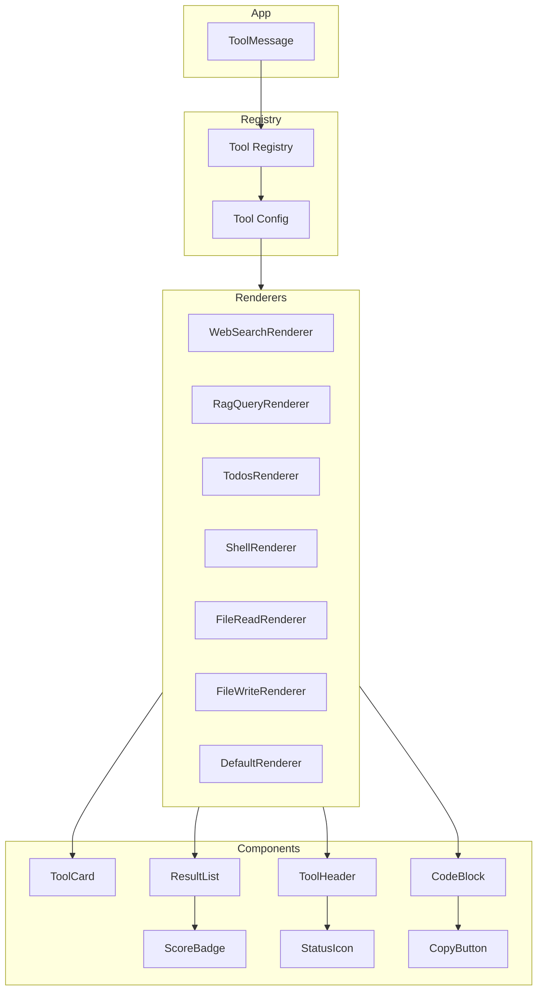
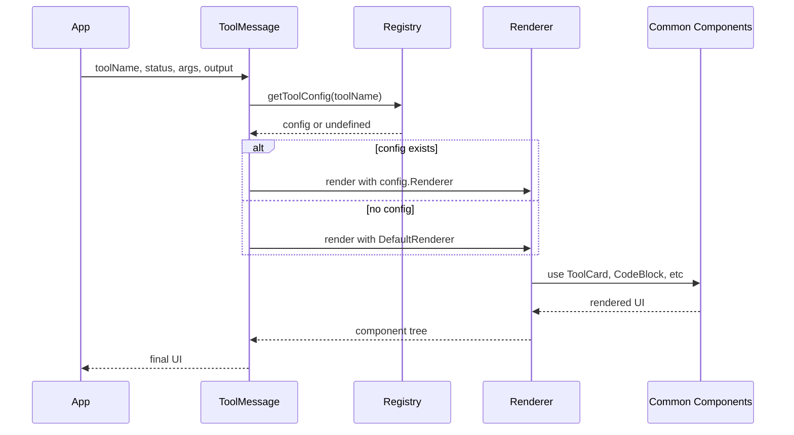

# ToolMessage 组件重构设计文档

## 一、背景与目标

### 1.1 现状问题
- **单一巨型组件**: ToolMessage 在 App.tsx 中有 500+ 行代码，包含所有工具的渲染逻辑
- **难以扩展**: 添加新工具需要修改核心文件，容易引入回归问题
- **代码重复**: 相似的 UI 模式（卡片、进度条、代码块）在不同工具中重复实现
- **样式混乱**: 工具样式分散在多个 CSS 文件中

### 1.2 重构目标
1. **可扩展性**: 通过工具注册表模式，支持快速添加新工具渲染器
2. **可维护性**: 每个工具渲染器独立文件，职责单一
3. **一致性**: 提取通用 UI 组件，确保视觉和交互一致
4. **性能**: 按需加载工具渲染器，减少初始包大小

---

## 二、架构设计

### 2.1 目录结构

```
frontend/src/ui/components/ToolMessage/
|-- index.ts                      # 导出入口
|-- ToolMessage.tsx               # 主组件（路由分发）
|-- ToolMessage.css               # 主样式
|-- types.ts                      # 类型定义
|-- registry.ts                   # 工具注册表
|
|-- common/                       # 通用渲染组件
|   |-- ToolCard.tsx              # 工具卡片容器
|   |-- ToolHeader.tsx            # 工具头部（图标+标题+状态）
|   |-- CodeBlock.tsx             # 代码块（带行号+语法高亮）
|   |-- ProgressBar.tsx           # 进度条
|   |-- ResultList.tsx            # 结果列表
|   |-- ScoreBadge.tsx            # 评分徽章
|   |-- StatusIcon.tsx            # 状态图标
|   |-- CopyButton.tsx            # 复制按钮
|   |-- index.ts
|
|-- renderers/                    # 工具渲染器
|   |-- WebSearchRenderer.tsx     # 网络搜索
|   |-- RagQueryRenderer.tsx      # RAG 检索
|   |-- TodosRenderer.tsx         # 任务列表
|   |-- ShellRenderer.tsx         # Shell/沙盒执行
|   |-- FileReadRenderer.tsx      # 文件读取
|   |-- FileWriteRenderer.tsx     # 文件写入
|   |-- FileEditRenderer.tsx      # 文件编辑
|   |-- HttpRequestRenderer.tsx   # HTTP 请求
|   |-- FetchUrlRenderer.tsx      # URL 抓取
|   |-- DirectoryRenderer.tsx     # 目录列表
|   |-- GrepRenderer.tsx          # 搜索/Grep
|   |-- TaskRenderer.tsx          # 子任务分派
|   |-- SandboxRenderer.tsx       # 沙盒执行（新增）
|   |-- ImageGenRenderer.tsx      # 图片生成（新增）
|   |-- DatabaseRenderer.tsx      # 数据库查询（新增）
|   |-- McpToolRenderer.tsx       # MCP 工具通用渲染（新增）
|   |-- DefaultRenderer.tsx       # 默认渲染
|   |-- index.ts
```

### 2.2 核心类型定义

```typescript
// types.ts

// 工具状态
export type ToolStatus = "running" | "done" | "error";

// 工具消息 Props
export interface ToolMessageProps {
  toolName: string;
  toolCallId?: string;
  status: ToolStatus;
  args?: unknown;
  output?: unknown;
  startTime?: number;    // 开始时间戳
  endTime?: number;      // 结束时间戳
  metadata?: Record<string, unknown>;  // 扩展元数据
}

// 工具渲染器 Props
export interface ToolRendererProps {
  status: ToolStatus;
  args: unknown;
  output: unknown;
  startTime?: number;
  endTime?: number;
  metadata?: Record<string, unknown>;
}

// 工具渲染器配置
export interface ToolRendererConfig {
  // 工具名称（支持多个别名）
  names: string[];
  // 渲染器组件
  Renderer: ComponentType<ToolRendererProps>;
  // 工具图标
  icon: ComponentType;
  // 显示名称生成器
  getDisplayName: (args: unknown) => string;
  // 默认是否展开
  defaultExpanded?: boolean | ((status: ToolStatus) => boolean);
  // 执行中时的提示信息生成器
  getRunningHint?: (args: unknown) => string;
}
```

### 2.3 工具注册表

```typescript
// registry.ts

import { ToolRendererConfig } from "./types";
import { WebSearchRenderer } from "./renderers/WebSearchRenderer";
import { RagQueryRenderer } from "./renderers/RagQueryRenderer";
// ... 其他导入

const registry: Map<string, ToolRendererConfig> = new Map();

// 注册工具
export function registerTool(config: ToolRendererConfig) {
  for (const name of config.names) {
    registry.set(name.toLowerCase(), config);
  }
}

// 获取工具配置
export function getToolConfig(toolName: string): ToolRendererConfig | undefined {
  return registry.get(toolName.toLowerCase());
}

// 初始化注册
export function initializeRegistry() {
  // 网络搜索
  registerTool({
    names: ["web_search", "search_web", "google_search"],
    Renderer: WebSearchRenderer,
    icon: Icons.Globe,
    getDisplayName: (args) => {
      const query = (args as any)?.query || "";
      return query ? `搜索: ${query}` : "网络搜索";
    },
    defaultExpanded: true,
    getRunningHint: (args) => {
      const query = (args as any)?.query || "";
      return `正在搜索${query ? `：${query}` : "..."}`;
    },
  });

  // RAG 检索
  registerTool({
    names: ["rag_query", "rag_search", "knowledge_search"],
    Renderer: RagQueryRenderer,
    icon: Icons.Search,
    getDisplayName: (args) => {
      const query = (args as any)?.query || "";
      return query ? `检索: ${query}` : "知识检索";
    },
    defaultExpanded: true,
    getRunningHint: (args) => {
      const query = (args as any)?.query || "";
      return `正在检索${query ? `：${query}` : "..."}`;
    },
  });

  // ... 注册其他工具
}
```

### 2.4 主组件

```typescript
// ToolMessage.tsx

import { useState, useMemo } from "preact/hooks";
import { getToolConfig } from "./registry";
import { ToolCard } from "./common/ToolCard";
import { ToolHeader } from "./common/ToolHeader";
import { DefaultRenderer } from "./renderers/DefaultRenderer";
import type { ToolMessageProps, ToolStatus } from "./types";

export function ToolMessage({
  toolName,
  toolCallId,
  status,
  args,
  output,
  startTime,
  endTime,
  metadata,
}: ToolMessageProps) {
  // 获取工具配置
  const config = useMemo(() => getToolConfig(toolName), [toolName]);
  
  // 计算默认展开状态
  const getDefaultExpanded = (): boolean => {
    if (status === "running") return true;
    if (!config) return false;
    if (typeof config.defaultExpanded === "function") {
      return config.defaultExpanded(status);
    }
    return config.defaultExpanded ?? false;
  };
  
  const [isOpen, setIsOpen] = useState(getDefaultExpanded);

  // 使用配置中的渲染器或默认渲染器
  const Renderer = config?.Renderer || DefaultRenderer;
  const Icon = config?.icon || Icons.Tool;
  
  // 生成显示名称
  const displayName = config?.getDisplayName?.(args) || toolName;
  
  // 执行中提示
  const runningHint = status === "running" && config?.getRunningHint
    ? config.getRunningHint(args)
    : null;
  
  // 计算执行时间
  const duration = startTime && endTime 
    ? ((endTime - startTime) / 1000).toFixed(2) 
    : null;

  return (
    <ToolCard status={status}>
      <ToolHeader
        icon={<Icon />}
        title={displayName}
        status={status}
        duration={duration}
        isOpen={isOpen}
        onToggle={() => setIsOpen(!isOpen)}
      />
      
      {isOpen && (
        <div class="tool-body">
          {runningHint ? (
            <div class="tool-running-hint">{runningHint}</div>
          ) : (
            <Renderer
              status={status}
              args={args}
              output={output}
              startTime={startTime}
              endTime={endTime}
              metadata={metadata}
            />
          )}
        </div>
      )}
    </ToolCard>
  );
}
```

---

## 三、通用组件设计

### 3.1 ToolCard - 工具卡片容器

```typescript
// common/ToolCard.tsx

interface ToolCardProps {
  status: ToolStatus;
  children: ComponentChildren;
  className?: string;
}

export function ToolCard({ status, children, className }: ToolCardProps) {
  const statusClass = {
    running: "tool-card--running",
    done: "tool-card--done",
    error: "tool-card--error",
  }[status];

  return (
    <div class={`tool-card ${statusClass} ${className || ""}`}>
      {children}
    </div>
  );
}
```

### 3.2 ToolHeader - 工具头部

```typescript
// common/ToolHeader.tsx

interface ToolHeaderProps {
  icon: ComponentChild;
  title: string;
  status: ToolStatus;
  duration?: string | null;
  isOpen: boolean;
  onToggle: () => void;
}

export function ToolHeader({
  icon,
  title,
  status,
  duration,
  isOpen,
  onToggle,
}: ToolHeaderProps) {
  return (
    <div class="tool-header" onClick={onToggle}>
      <div class="tool-header__left">
        <StatusIcon status={status} />
        <span class="tool-header__icon">{icon}</span>
        <span class="tool-header__title">{title}</span>
      </div>
      <div class="tool-header__right">
        {duration && (
          <span class="tool-header__duration">{duration}s</span>
        )}
        <span class="tool-header__chevron">
          {isOpen ? <Icons.ChevronDown /> : <Icons.ChevronRight />}
        </span>
      </div>
    </div>
  );
}
```

### 3.3 CodeBlock - 代码块

```typescript
// common/CodeBlock.tsx

interface CodeBlockProps {
  code: string;
  language?: string;
  showLineNumbers?: boolean;
  maxLines?: number;
  onCopy?: () => void;
}

export function CodeBlock({
  code,
  language,
  showLineNumbers = true,
  maxLines = 100,
  onCopy,
}: CodeBlockProps) {
  const lines = code.split("\n");
  const displayLines = lines.slice(0, maxLines);
  const hasMore = lines.length > maxLines;

  const handleCopy = async () => {
    await navigator.clipboard.writeText(code);
    onCopy?.();
  };

  return (
    <div class="code-block">
      <div class="code-block__header">
        {language && <span class="code-block__lang">{language}</span>}
        <CopyButton onClick={handleCopy} />
      </div>
      <pre class="code-block__content">
        {displayLines.map((line, idx) => (
          <div key={idx} class="code-line">
            {showLineNumbers && (
              <span class="code-line__number">{idx + 1}</span>
            )}
            <span class="code-line__content">{line}</span>
          </div>
        ))}
        {hasMore && (
          <div class="code-block__more">
            还有 {lines.length - maxLines} 行...
          </div>
        )}
      </pre>
    </div>
  );
}
```

### 3.4 ResultList - 结果列表

```typescript
// common/ResultList.tsx

interface ResultItem {
  id: string | number;
  title?: string;
  content: string;
  url?: string;
  score?: number;
  source?: string;
  icon?: ComponentChild;
}

interface ResultListProps {
  items: ResultItem[];
  emptyText?: string;
  maxItems?: number;
  showScore?: boolean;
  onItemClick?: (item: ResultItem) => void;
}

export function ResultList({
  items,
  emptyText = "暂无结果",
  maxItems = 10,
  showScore = false,
  onItemClick,
}: ResultListProps) {
  if (!items.length) {
    return <div class="result-list__empty">{emptyText}</div>;
  }

  const displayItems = items.slice(0, maxItems);
  const hasMore = items.length > maxItems;

  return (
    <div class="result-list">
      {displayItems.map((item) => (
        <div
          key={item.id}
          class="result-item"
          onClick={() => onItemClick?.(item)}
        >
          <div class="result-item__header">
            {item.icon && <span class="result-item__icon">{item.icon}</span>}
            {item.title && (
              <span class="result-item__title">{item.title}</span>
            )}
            {showScore && item.score !== undefined && (
              <ScoreBadge score={item.score} />
            )}
          </div>
          <div class="result-item__content">{item.content}</div>
          {(item.url || item.source) && (
            <div class="result-item__meta">
              {item.url && (
                <a
                  href={item.url}
                  target="_blank"
                  rel="noreferrer"
                  class="result-item__link"
                >
                  <Icons.Link />
                  {new URL(item.url).hostname}
                </a>
              )}
              {item.source && (
                <span class="result-item__source">
                  <Icons.Pdf />
                  {item.source}
                </span>
              )}
            </div>
          )}
        </div>
      ))}
      {hasMore && (
        <div class="result-list__more">
          还有 {items.length - maxItems} 条结果...
        </div>
      )}
    </div>
  );
}
```

### 3.5 ScoreBadge - 评分徽章

```typescript
// common/ScoreBadge.tsx

interface ScoreBadgeProps {
  score: number;  // 0-1 或 0-100
  showLabel?: boolean;
}

export function ScoreBadge({ score, showLabel = true }: ScoreBadgeProps) {
  // 统一转换为百分比
  const percent = score <= 1 ? Math.round(score * 100) : Math.round(score);
  
  // 颜色分级
  const getColor = () => {
    if (percent >= 80) return "var(--color-success)";
    if (percent >= 60) return "var(--color-warning)";
    return "var(--color-muted)";
  };
  
  // 标签
  const getLabel = () => {
    if (percent >= 80) return "高相关";
    if (percent >= 60) return "中相关";
    return "低相关";
  };

  return (
    <div class="score-badge" style={{ color: getColor() }}>
      {showLabel && <span class="score-badge__label">{getLabel()}</span>}
      <span class="score-badge__value">{percent}%</span>
    </div>
  );
}
```

---

## 四、工具渲染器示例

### 4.1 WebSearchRenderer

```typescript
// renderers/WebSearchRenderer.tsx

import { ResultList, ResultItem } from "../common";
import type { ToolRendererProps } from "../types";

export function WebSearchRenderer({ status, output }: ToolRendererProps) {
  if (status !== "done" || !output) {
    return null;
  }

  // 解析输出
  const data = typeof output === "string" ? JSON.parse(output) : output;
  const results = (data as any).results || [];

  // 转换为通用结果项
  const items: ResultItem[] = results.map((r: any, idx: number) => ({
    id: idx,
    title: r.title,
    content: r.content || r.snippet || "",
    url: r.url,
    score: r.score,
    icon: <Icons.Globe />,
  }));

  return (
    <ResultList
      items={items}
      showScore={true}
      emptyText="暂无搜索结果"
    />
  );
}
```

### 4.2 ShellRenderer - 沙盒执行

```typescript
// renderers/ShellRenderer.tsx

import { CodeBlock } from "../common";
import type { ToolRendererProps } from "../types";

export function ShellRenderer({ status, args, output }: ToolRendererProps) {
  const command = (args as any)?.command || (args as any)?.cmd || "";
  
  // 解析输出，分离 stdout 和 stderr
  let stdout = "";
  let stderr = "";
  let exitCode: number | null = null;
  
  if (output) {
    if (typeof output === "string") {
      stdout = output;
    } else {
      stdout = (output as any).stdout || "";
      stderr = (output as any).stderr || "";
      exitCode = (output as any).exit_code ?? (output as any).exitCode ?? null;
    }
  }

  return (
    <div class="shell-renderer">
      {/* 命令行 */}
      <div class="shell-command">
        <span class="shell-prompt">$</span>
        <code class="shell-cmd">{command}</code>
        {exitCode !== null && (
          <span class={`shell-exit-code ${exitCode === 0 ? "success" : "error"}`}>
            exit: {exitCode}
          </span>
        )}
      </div>
      
      {/* 标准输出 */}
      {stdout && (
        <div class="shell-output">
          <div class="shell-output-label">stdout</div>
          <CodeBlock code={stdout} language="text" showLineNumbers={false} />
        </div>
      )}
      
      {/* 标准错误 */}
      {stderr && (
        <div class="shell-output shell-output--error">
          <div class="shell-output-label">stderr</div>
          <CodeBlock code={stderr} language="text" showLineNumbers={false} />
        </div>
      )}
    </div>
  );
}
```

### 4.3 TodosRenderer - 任务列表

```typescript
// renderers/TodosRenderer.tsx

import type { ToolRendererProps } from "../types";

interface TodoItem {
  content: string;
  status: "pending" | "in_progress" | "completed";
  priority?: "low" | "medium" | "high";
}

export function TodosRenderer({ status, args, output }: ToolRendererProps) {
  // 从多个来源提取 todos
  const todos: TodoItem[] = (() => {
    if ((args as any)?.todos) return (args as any).todos;
    if ((output as any)?.todos) return (output as any).todos;
    if (Array.isArray(output)) return output;
    
    // 尝试从字符串解析
    if (typeof output === "string") {
      try {
        const match = output.match(/\[.*\]/);
        if (match) {
          return JSON.parse(match[0].replace(/'/g, '"'));
        }
      } catch (e) {
        // 忽略解析错误
      }
    }
    return [];
  })();

  if (!todos.length) {
    return <div class="todos-empty">暂无任务</div>;
  }

  // 统计
  const completed = todos.filter((t) => t.status === "completed").length;
  const total = todos.length;

  return (
    <div class="todos-renderer">
      {/* 进度条 */}
      <div class="todos-progress">
        <div class="todos-progress-bar">
          <div
            class="todos-progress-fill"
            style={{ width: `${(completed / total) * 100}%` }}
          />
        </div>
        <span class="todos-progress-text">
          {completed}/{total} 已完成
        </span>
      </div>
      
      {/* 任务列表 */}
      <div class="todos-list">
        {todos.map((todo, idx) => (
          <div key={idx} class={`todo-item todo-item--${todo.status}`}>
            <div class="todo-checkbox">
              {todo.status === "completed" && <Icons.Check />}
              {todo.status === "in_progress" && <div class="todo-spinner" />}
              {todo.status === "pending" && <div class="todo-circle" />}
            </div>
            <span class="todo-content">{todo.content}</span>
            {todo.priority === "high" && (
              <span class="todo-priority todo-priority--high">高优先级</span>
            )}
          </div>
        ))}
      </div>
    </div>
  );
}
```

---

## 五、样式设计

### 5.1 CSS 变量

```css
/* ToolMessage.css */

:root {
  /* 工具状态颜色 */
  --tool-running-color: #1a73e8;
  --tool-done-color: #5f6368;
  --tool-error-color: #d93025;
  
  /* 评分颜色 */
  --score-high: #34a853;
  --score-medium: #fbbc04;
  --score-low: #9e9e9e;
  
  /* 工具卡片 */
  --tool-card-bg: #ffffff;
  --tool-card-border: rgba(0, 0, 0, 0.08);
  --tool-card-shadow: 0 1px 3px rgba(0, 0, 0, 0.06);
  
  /* 代码块 */
  --code-bg: #f5f5f5;
  --code-border: rgba(0, 0, 0, 0.08);
  --code-line-number: #9e9e9e;
}
```

### 5.2 工具卡片样式

```css
.tool-card {
  background: var(--tool-card-bg);
  border: 1px solid var(--tool-card-border);
  border-radius: 12px;
  overflow: hidden;
  box-shadow: var(--tool-card-shadow);
  transition: border-color 0.2s;
}

.tool-card--running {
  border-color: var(--tool-running-color);
  border-left-width: 3px;
}

.tool-card--error {
  border-color: var(--tool-error-color);
  border-left-width: 3px;
}

.tool-header {
  display: flex;
  align-items: center;
  justify-content: space-between;
  padding: 10px 14px;
  cursor: pointer;
  user-select: none;
  transition: background 0.15s;
}

.tool-header:hover {
  background: rgba(0, 0, 0, 0.03);
}

.tool-header__left {
  display: flex;
  align-items: center;
  gap: 8px;
}

.tool-header__title {
  font-size: 13px;
  font-weight: 500;
  color: #1a1a1a;
}

.tool-header__duration {
  font-size: 12px;
  color: #9e9e9e;
  font-family: var(--font-mono);
}

.tool-body {
  padding: 0 14px 14px;
}
```

---

## 六、交互增强

### 6.1 复制功能

```typescript
// common/CopyButton.tsx

import { useState } from "preact/hooks";

interface CopyButtonProps {
  onClick: () => void;
}

export function CopyButton({ onClick }: CopyButtonProps) {
  const [copied, setCopied] = useState(false);

  const handleClick = () => {
    onClick();
    setCopied(true);
    setTimeout(() => setCopied(false), 2000);
  };

  return (
    <button
      type="button"
      class={`copy-button ${copied ? "copy-button--copied" : ""}`}
      onClick={handleClick}
      title={copied ? "已复制" : "复制"}
    >
      {copied ? <Icons.Check /> : <Icons.Copy />}
    </button>
  );
}
```

### 6.2 结果分页

```typescript
// common/Pagination.tsx

interface PaginationProps {
  total: number;
  pageSize: number;
  current: number;
  onChange: (page: number) => void;
}

export function Pagination({
  total,
  pageSize,
  current,
  onChange,
}: PaginationProps) {
  const totalPages = Math.ceil(total / pageSize);
  
  if (totalPages <= 1) return null;

  return (
    <div class="pagination">
      <button
        disabled={current === 1}
        onClick={() => onChange(current - 1)}
      >
        上一页
      </button>
      <span class="pagination-info">
        {current} / {totalPages}
      </span>
      <button
        disabled={current === totalPages}
        onClick={() => onChange(current + 1)}
      >
        下一页
      </button>
    </div>
  );
}
```

---

## 七、实施计划

### Phase 1: 基础架构（2-3 小时）
- [ ] 创建目录结构
- [ ] 定义类型系统
- [ ] 实现工具注册表
- [ ] 实现 ToolMessage 主组件

### Phase 2: 通用组件（2-3 小时）
- [ ] 实现 ToolCard
- [ ] 实现 ToolHeader
- [ ] 实现 CodeBlock
- [ ] 实现 ResultList
- [ ] 实现 ScoreBadge
- [ ] 实现 StatusIcon
- [ ] 实现 CopyButton

### Phase 3: 工具渲染器迁移（3-4 小时）
- [ ] WebSearchRenderer
- [ ] RagQueryRenderer
- [ ] TodosRenderer
- [ ] ShellRenderer
- [ ] FileReadRenderer
- [ ] FileWriteRenderer
- [ ] FileEditRenderer
- [ ] HttpRequestRenderer
- [ ] FetchUrlRenderer
- [ ] DirectoryRenderer
- [ ] GrepRenderer
- [ ] TaskRenderer
- [ ] DefaultRenderer

### Phase 4: 新功能（2-3 小时）
- [ ] SandboxRenderer（stdout/stderr 分离）
- [ ] ImageGenRenderer（图片预览）
- [ ] DatabaseRenderer（表格渲染）
- [ ] McpToolRenderer（通用 MCP）

### Phase 5: 集成与测试（1-2 小时）
- [ ] 替换 App.tsx 中的旧 ToolMessage
- [ ] 样式迁移
- [ ] 功能测试
- [ ] 性能优化

---

## 八、Mermaid 架构图




